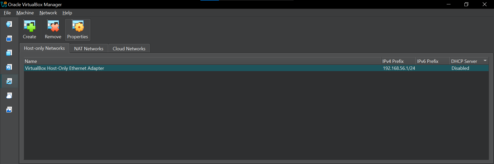

# DoS Attack Simulation Using hping3 and Wireshark

## Overview

This lab demonstrates a controlled **Denial-of-Service (DoS) attack simulation** using `hping3` on Kali Linux and Wireshark on a Windows 10 victim machine.

The purpose of this lab was to understand how a **TCP SYN flood** appears in network traffic and how security tools can be used to observe and identify unusual traffic patterns.

The complete activity was performed in an isolated VirtualBox Host-Only network.

## Lab Environment

| Component | Details |
|---|---|
| Attacker | Kali Linux |
| Victim | Windows 10 |
| Virtualization | Oracle VirtualBox |
| Network Type | Host-Only Adapter |
| Attacker IP | `192.168.56.10` |
| Victim IP | `192.168.56.20` |
| Host-Only Network | `192.168.56.1/24` |
| Attack Tool | hping3 |
| Traffic Analysis | Wireshark |
| Target Service | IIS / HTTP |
| Target Port | 80 |

---

## 1. Configure VirtualBox Host-Only Network

A Host-Only network was configured in VirtualBox so that the Kali Linux attacker VM and Windows 10 victim VM could communicate in an isolated lab environment.

The Host-Only network was configured with:

- IPv4 Address: `192.168.56.1`
- Network Mask: `255.255.255.0`
- DHCP: Disabled

### Screenshot



---

## 2. Configure VM Network Adapters

Both virtual machines were configured to use the Host-Only network adapter.

### Screenshots


---

## 3. Assign Static IP Addresses

Static IP addresses were configured for the lab machines so that the attacker and victim could communicate using fixed addresses.

### Screenshot


### Windows Victim IP Configuration

The Windows 10 victim machine was configured with:

- IP Address: `192.168.56.20`
- Subnet Mask: `255.255.255.0`
- Default Gateway: `192.168.56.1`

### Screenshots


---

## 4. Verify Network Configuration

The IP configuration of both machines was checked before starting the traffic simulation.

### Victim Machine

The Windows victim machine was configured with the expected IP address.


### Attacker Machine

The Kali Linux attacker machine was configured with the expected IP address.


### Connectivity Verification

Network connectivity between the lab machines was checked before continuing with the simulation.


---

## 5. Start a Service on the Windows Victim

To provide a target service for the lab, IIS Web Server was enabled on the Windows 10 machine.

### Enable IIS

Windows Features was opened through Control Panel and Internet Information Services (IIS) was selected.


The required Web Management Tools and World Wide Web Services components were enabled.


After installation, IIS was verified by opening:

```text
http://localhost
```


---

## 6. Start Packet Capture in Wireshark

Wireshark was started on the Windows victim machine with administrator privileges.

The Ethernet interface connected to the Host-Only network was selected and packet capture was started.


---

## 7. Simulate a TCP SYN Flood

For this controlled lab, `hping3` was used from the Kali Linux machine to generate TCP SYN packets toward the IIS service on the Windows victim machine.

The command used was:

```bash
sudo hping3 -S --flood -p 80 192.168.56.20
```

### Command Explanation

- `-S` — sends TCP SYN packets.
- `--flood` — sends packets at a very high rate.
- `-p 80` — targets TCP port 80.
- `192.168.56.20` — Windows victim machine.

### Screenshot


---

## 8. Observe the Attack in Wireshark

### Filter for SYN Packets

The following Wireshark display filter was used to identify TCP SYN packets that did not contain the ACK flag:

```text
tcp.flags.syn == 1 and tcp.flags.ack == 0
```


### Examine Packet Details

A captured SYN packet was selected and the TCP section was expanded to examine the SYN and ACK flags.


### View I/O Graph

Wireshark's **Statistics → I/O Graph** was used to observe the packet rate during the simulation.


A significant increase in packet activity could be observed during the simulation.


### View Protocol Hierarchy

Wireshark's **Statistics → Protocol Hierarchy** was used to examine the distribution of network traffic.


---

## 9. Verify the Impact on the Windows Victim

### Check Network Connections

The following command was used from an administrator Command Prompt:

```cmd
netstat -an | find "80"
```

This was used to observe connections associated with port 80 and identify connections in states such as `SYN_RECEIVED`.


### Check Event Viewer

Windows Event Viewer was checked under:

```text
Windows Logs → System
```

This was used to look for relevant system or TCP/IP events during the simulation.


---

## 10. Observations

During the simulation, the following observations were made:

- A large number of TCP SYN packets were generated toward the Windows victim.
- Wireshark captured the SYN traffic from the Kali machine.
- The SYN filter helped identify the relevant packets.
- The TCP packet details showed the SYN flag set and ACK flag not set.
- The I/O Graph showed increased packet activity during the simulation.
- Protocol Hierarchy helped examine the overall traffic distribution.
- `netstat` was used to observe connections associated with port 80.
- Windows Event Viewer was checked for relevant system events.

## 11. What I Learned

Through this lab, I learned:

- How to create an isolated Host-Only network in VirtualBox.
- How to configure static IP addresses for virtual machines.
- How to enable and verify IIS on Windows.
- How to use `hping3` to generate TCP SYN traffic in a controlled environment.
- How to capture network traffic using Wireshark.
- How to use Wireshark filters to identify SYN packets.
- How I/O Graphs and Protocol Hierarchy can help analyze unusual traffic.
- How `netstat` and Event Viewer can be used to check the effect of unusual network activity.

## 12. Conclusion

This lab helped me understand how a TCP SYN flood can appear from a network traffic analysis perspective. By generating traffic in an isolated VirtualBox environment and analyzing it with Wireshark, I was able to observe SYN packets, packet-rate changes, and TCP connection states.

The exercise also helped me understand the importance of network monitoring and traffic analysis for identifying abnormal network behavior.

## Ethical and Legal Note

This experiment was performed only in an isolated VirtualBox lab using systems under my control.

Do not perform DoS or SYN-flood testing against public websites, networks, or systems without explicit authorization. Such activity can disrupt services and may violate laws or organizational policies.